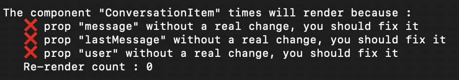

# pure-debug
React PureComponent debugger. This component log why your PureComponent will render.
## Installation
With npm

```npm install react-pure-debug --save```
## Usage
```ìmport PureDebug from 'react-pure-debug';```

In your component class, you have just to replace :

```MyComponent extends React.PureComponent {...```

by

```MyComponent extends PureDebug {...```

## The result
You will see log like this in your console.

- Red cross when the prop or state is the same but not the strict comparaison
- Green check when the prop or state are different.

Comming soon :

memoDebug()
